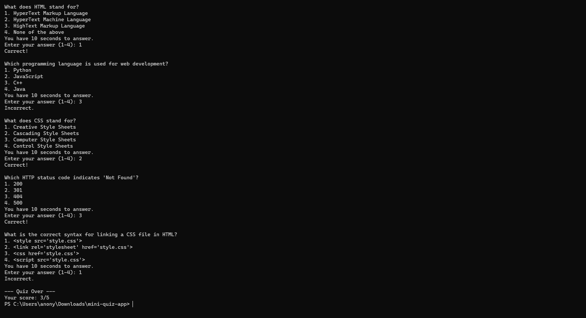

# Coding Quiz App

A simple multiple-choice quiz game written in C. This program features questions related to coding and web development, tracks the score, and includes a timer for each question.

## OUTPUT:


## Features
- Five coding and web-related multiple-choice questions.
- Timer: Each question must be answered within 10 seconds.
- Score tracker displayed at the end of the quiz.

## Questions
Example questions include:
- What does HTML stand for?
- Which programming language is used for web development?
- What is the correct syntax for linking a CSS file in HTML?

## How to Run

### Using the Shell Script
1. Clone the repository:
   ```bash
   git clone https://github.com/GET-UNKNOWN-ERR0R/mini-quiz-app.git
   cd coding-quiz
   ./run.sh
   
## Manually Compile The Code:
   ```bash
   gcc quiz.c -o quiz -lm
   ./quiz


